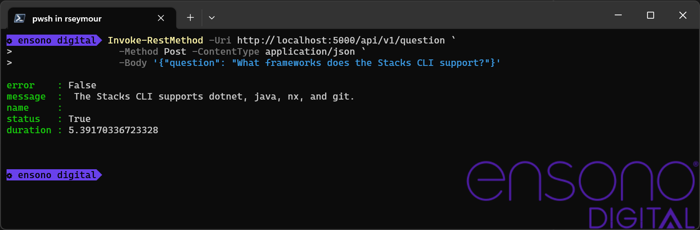

== Ask a Question

Now that the documents have been uploaded and have been indexed, it is possible to ask the Question API a question about the content of the documents.

NOTE: The examples shown below display results from an existing Index and Azure OpenAI instance. Additionally the examples use the container instances that have been configured using Docker compose. If this has been deployed into Kubernetes then the URI will need to be modified.

The Question API accepts JSON based questions and returns a JSON response. The following shows how this can be achieved using both PowerShell and the `curl` command.

[cols="1a,1a",option=headers]
|===
| PowerShell | Curl
|
[source, powershell,subs="attributes"]
----
Invoke-RestMethod -Uri http://localhost:5000/api/v1/question `
                  -Method Post `
                  -Headers @{x_api_key = "{api_key}"} `
                  -ContentType application/json `
                  -Body '{"question": "What frameworks does the Stacks CLI support?"}'
----
|
[source, bash,subs="attributes"]
----
curl -X POST \
     -H "Content-Type: application/json" \
     -H "x_api_key: {api_key}" \
     -d '{"question": "What frameworks does the Stacks CLI support?"}' \
     http://localhost:5000/api/v1/question
----
|===

In both case the response will be similar to the following image.

.Answer to the posed question
