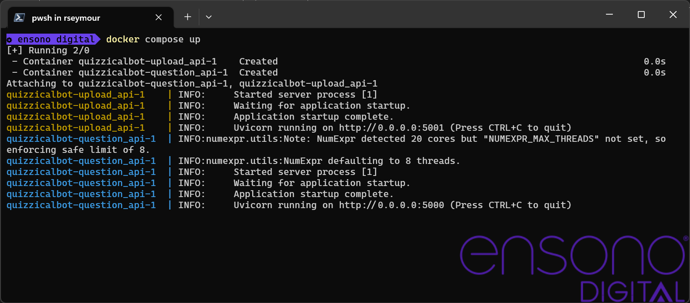
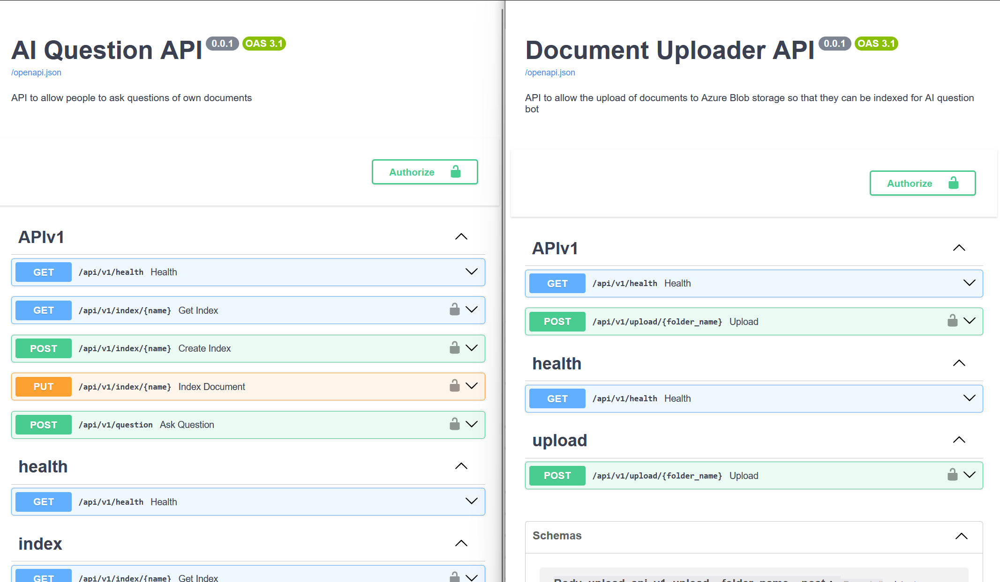

== Quickstart

The repository contains a Docker compose file that will run the two APIs for the application so that it can be tested locally to see the sort of responses that are returned.

There are a number of environment variables that need to be configured to run the application. The following table defines the variables that need to be set before running the compose command.

include::includes/envvars.adoc[]

Create a file for the environment at `local/envfile` with appropriate values for the variables as detailed in the table above.

THe file that controls how Docker Compose will bring up the services is `compose.yaml`. The file contains two services, one for the Question AP and one for the Upload API. By default it will attempt to build the images locally and then run the. However if a container engine is not installed, a pre-built image can be used. Please edit the `compose.yaml` file to determine how the service images are retrieved.

[source,bash]
----
docker compose up
----

.Running the services with Docker compose

Once the containers are running the OpenAPI documentation for each service can be access using the relevant URLs:

.List of URLs for accessing the OpenAPI documentation for each service
[cols="1,2",options="header"]
|===
| Service | URL
| Question API | http://localhost:5000/docs
| Upload API | http://localhost:5001/docs
|===

.OpenAPI Documentation from each service
